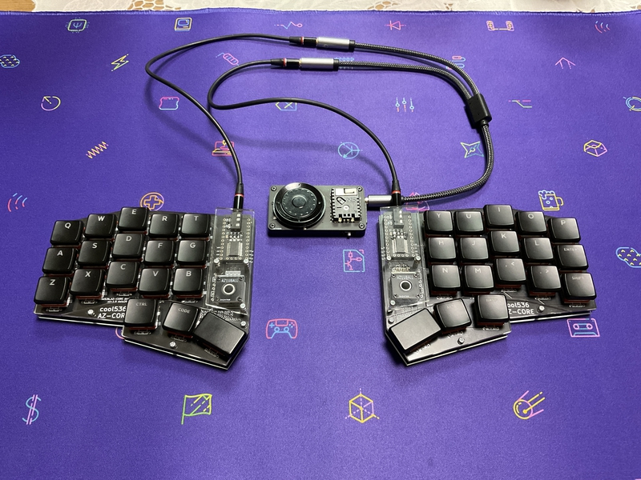

# cool536azcore

# What is cool536azcore?

Do you know AZ-CORE?
 
https://palette-system.booth.pm/items/4086382
https://github.com/palette-system/az-core

 
cool536azcore is a keyboard powered by az-core and Panda Micro.
 
The PCB and acrylic plate were designed by me.
 
I made the cool536azcore a keyboard with 36 keys and a trackball that you can use without moving your hands too much.
 
