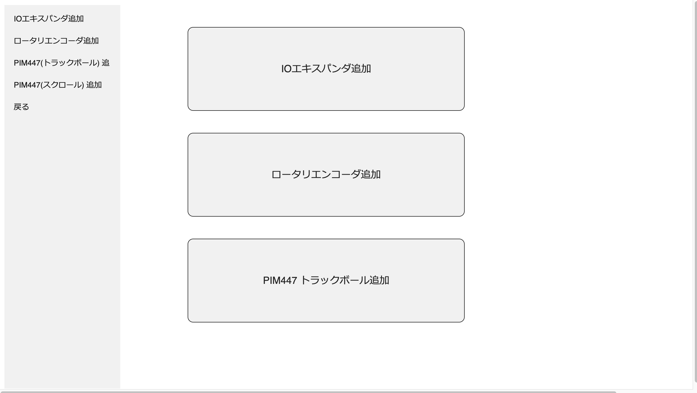
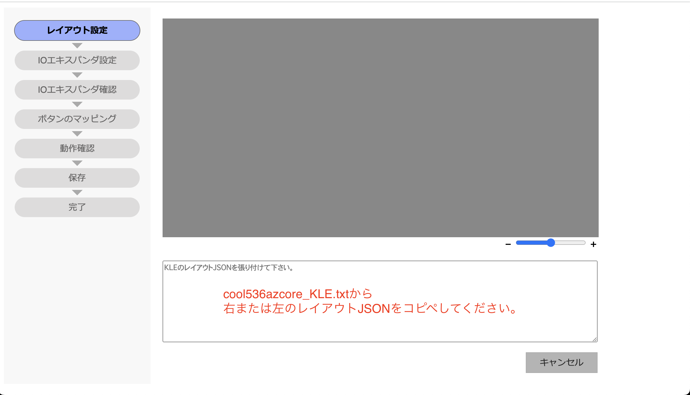
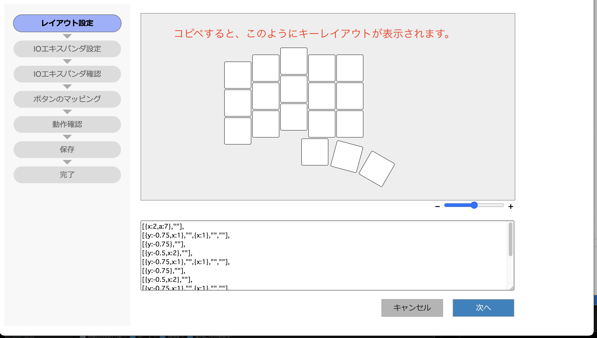
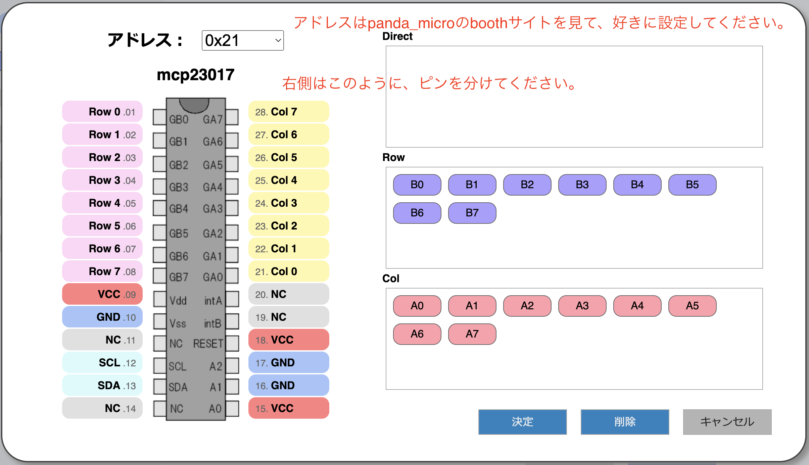
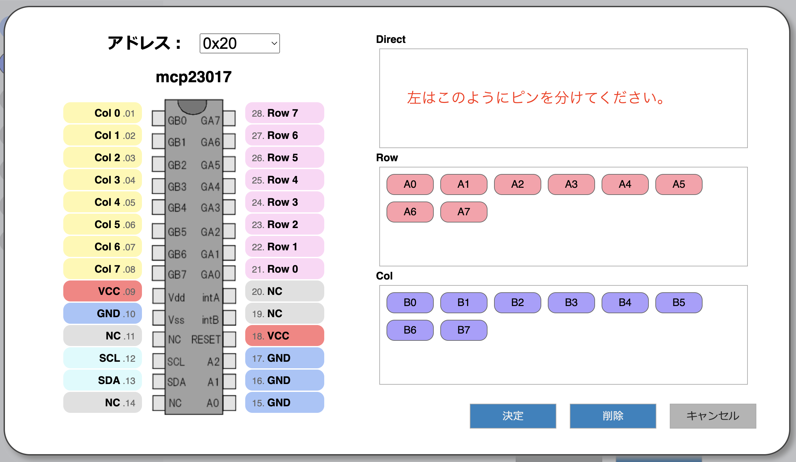
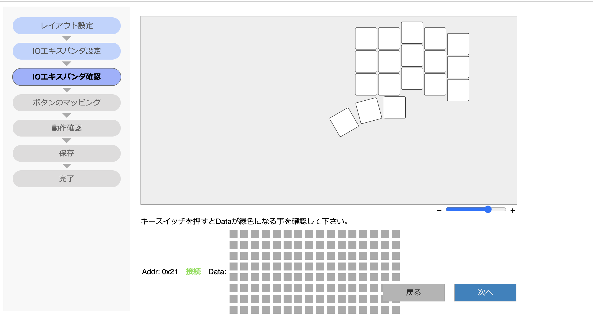

# cool536azcoreをAZTOOLでの設定について

## 1 AZTOOLをchromeで起動させる。

https://palette-system.github.io/aztool/

## 2 キーボードに接続をクリック

## 3 I2Cオプションをクリック

## 4 レイアウト設定

## 5 IOエキスパンダ設定
右側

左側

※アドレスとピンの分け方が違うことに注意してください。

## 6 IOエキスパンダ確認

ここから先は、説明しません。AZTOOLの指示に従えば、大丈夫です。
