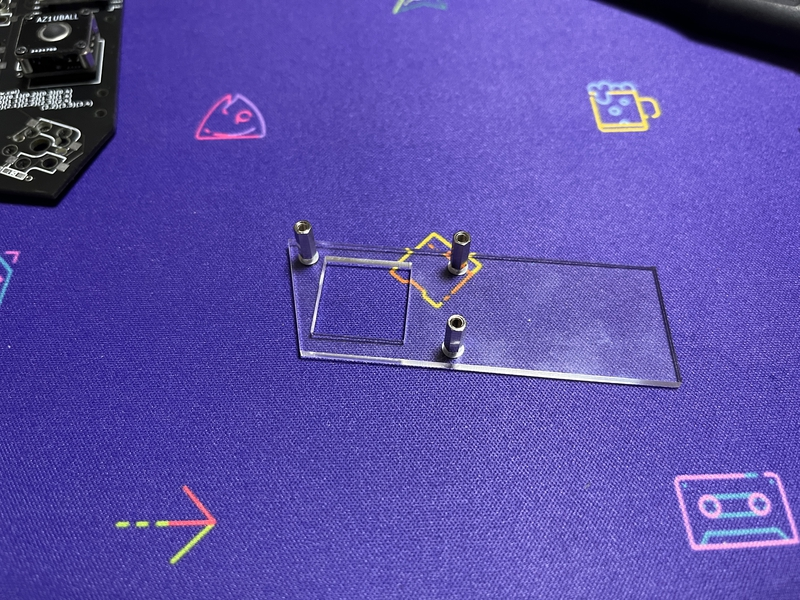

# Build guide

## Parts list

| No. | Patrs | Quantity | remarks | Suppliers | Cost |
|--|--|--|--|--|--|
|番号|名前|数|備考|調達先|参考価格（送料込）| 
|1|PCB|2|40%splite keyboard|[elecrow](https://www.elecrow.com) [JLCPCB](https://jlcpcb.com) [ALLPCB](https://www.allpcb.com)|５枚で10〜20ドル| 
|2-1|Switch Plate1 スイッチプレート1|2|アクリル [Plate data](https://github.com/telzo2000/cool536/tree/main/case_design)|[工房Emerge+](https://www.emergeplus.jp/laser-cutting-service/contact/) [遊舎工房](https://yushakobo.jp) [elecrow](https://www.elecrow.com)|種類による。|
|2-2|Switch Plate2 スイッチプレート2|2|↑|↑|↑|
|2-3|Switch Plate3 スイッチプレート3|2|↑|↑|↑|
|2-4|Cover Plate カバープレート|2|↑|↑|↑|
|2-5|Bottom Plate ボトムプレート|2|↑|↑|↑|
|3|M2screw M2ネジ|26|3mm BottomPlate(20)とCoverPlate(6)で使用|DIYショップなど|10本で100円程度|
|4|M2screw M2ネジ|6|8mm BottomPlateで使用|↑|↑|
|5A|M2screw M2ネジ|22|8mm MXスイッチ使用時SwitchPlate1・2で使用|↑|↑|
|5B|M2screw M2ネジ|22|5mm chocスッチ使用時SwitchPlate1・2で使用|↑|↑|
|6A|M2spacer M2スペーサー|50|3mmメス-メス MXスイッチ使用時|[ヒロスギネット](https://www.hirosugi-net.co.jp/shop/c/c10/) [遊舎工房](https://yushakobo.jp)|20本で800円程度|
|6B|M2spacer M2スペーサー|28|3mmメス-メス chocスイッチ使用時|[ヒロスギネット](https://www.hirosugi-net.co.jp/shop/c/c10/) [遊舎工房](https://yushakobo.jp)|20本で800円程度|
|7|M2spacer M2スペーサー|6|8mmメス-メス CoverPlateで使用|[ヒロスギネット](https://www.hirosugi-net.co.jp/shop/c/c10/) [遊舎工房](https://yushakobo.jp)|20本で800円程度|
|8A|Swith socket スイッチソケット|38|cherry MX互換|[遊舎工房](https://yushakobo.jp) [Talp Keyboard](https://talpkeyboard.net) [Daily Craft Keyboard](https://shop.dailycraft.jp)等|10個で165円程度|
|8B|Swith socket スイッチソケット|38|choc互換|[遊舎工房](https://yushakobo.jp) [Talp Keyboard](https://talpkeyboard.net) [Daily Craft Keyboard](https://shop.dailycraft.jp)等|10個で165円程度|
|9|Diode ダイオード|39|リードタイプでもSMDでも可|[遊舎工房](https://yushakobo.jp) [Talp Keyboard](https://talpkeyboard.net) [Daily Craft Keyboard](https://shop.dailycraft.jp)等|100個で220円程度から|
|10|AZ-CORE|1|whiteでもBlackでも可|[パレットシステムAZ-CORE](https://booth.pm/ja/items/3985327) [パレットシステムAZ-CORE BLACK](https://booth.pm/ja/items/4086382)|9500円|
|11|PAnda_micro|2||[パレットシステムPada_micro](https://booth.pm/ja/items/3959822)|500円〜|
|12|AZ1UBALL|0〜2||[パレットシステムAZ1UBALL](https://booth.pm/ja/items/4202085)|2500円|

In addition, you will need a TRRS cable, keycaps, etc.
 
この他に、TRRSケーブル(通常１本)、キーキャップ等が必要です。

 

## Firmware

###  AZTOOL
[Here](https://github.com/palette-system/aztool)

 

## Build 1(PCB only)

### 1 Parts check

The cool536azcore2 is a PCB that uses both the front and back sides for left and right PCBs.
 
cool536azcore2は左右のPCBに対して、表裏両面を使用するPCBです。
 

### 2 Diode soldering

Solder the diodes to the back of each of the left and right.
 
左右それぞれの裏面にダイオードのハンダ付けをします。
 

There are lead type and SMD diodes.
 
ダイオードはリードタイプか、SMDがあります。
 
Here, we will explain the lead type soldering.
 
ここでは、リードタイプのハンダ付けの説明をします。
 
However, those who adopt the choc switch should use SMD diodes.
 
ただし、chocスイッチを採用する人は、SMDのダイオードを使用してください。
 

Use a lead bender to bend the legs of the diode.
 
リードベンダーを使い、ダイオードの足を曲げます。
 

Insert the diode into the board.
 
ダイオードを基板に挿しこみます。
 

Please pay attention to the orientation of the diode.
 
ダイオードの向きに注意してください。
 

Secure the diode with masking tape, then face up.
 
マスキングテープでダイオードを固定してから、表面を上にします。
 
Solder the protruding legs.
 
はみ出ている足部分に、ハンダ付けをします。
 
After soldering, use nippers to cut off the protruding legs.
 
はんだ付けが終わったら、はみ出ている足をニッパーで切り取ってください。
 

[８倍速　Diodeハンダ付け動画](https://youtu.be/Yaodh2-XxV4)

 
 

### 3 Soldering switch sockets

Notice  
A switch socket cannot be attached to the place where AZ-CORE is placed.
 
AZ-COREを置く場所にはスイッチソケットをつけることができません。
 
 
Solder the switch sockets on the back side.
 
裏面にスイッチソケットのハンダ付けをします。
 
cool536azcore2 is compatible with both choc and cherry MX switches.
 
cool536azcore2はchocスイッチとcherryMXスイッチの両方に対応しています。
 
Both can be installed.
 
両方を取り付けることが可能です。
 
Here, solder the cherryMX switch.
 
ここでは、cherryMXスイッチのハンダ付けを行います。
 
Place the switch socket on the white frame.
 
白枠に、スイッチソケットを乗せてください。
 
That is the correct switch socket orientation.
 
それが正しいスイッチソケットの向きになります。
 
Place the switch socket on the white frame in the same way for the choc switch.
 
chocスイッチの時も同じように、白枠にスイッチソケットを乗せてください。
 

Apply solder to both pads.
 
両方のパッドにハンダを盛ります。
 
Place the switch socket and fix it with a warm soldering iron while melting the solder.
 
スイッチソケットを乗せて、温めたハンダゴテで、ハンダを溶かしながら、固定します。
 
You can make it easier by working while holding it with tweezers.
 
ピンセットで押さえながら、作業をすると楽にできます。
 

[８倍速　Switch socketハンダ付け動画](https://youtu.be/E__mHvmIXQo)

  

### 4　Soldering 7pins 

The connection between AZ-CORE and cool536azcore2 is done with 7 pins.
 
AZ-COREとcool536azcore2との接続は、7本のピンで行います。
  
Cut the pin and adjust the length.
 
ピンをカットして、長さを調整してください。

When attaching AZ-CORE to the right side, insert the pin from the bottom and solder it as shown in the image below.
 
AZ-COREを右側に付けるときは、下の画像のように、下からピンを差し込み、はんだ付けをしてください。
 

When attaching AZ-CORE to the left side, insert the pin from the bottom and solder it as shown in the image below.
 
AZ-COREを左側に付けるときは、下の画像のように、下からピンを差し込み、はんだ付けをしてください。
 

By doing this, the power supply of AZ-CORE will be on the outside, making it easier to operate.
 
この向きにすることで、AZ-COREの電源が外側になり、操作しやすくなります。
 
 

### 5 Rotery Encoder

cool536azcore2 can have 2 switches and 1 rotary encoder on the side without AZ-CORE.
 
cool536azcore2では、AZ-COREを付けない側に、スイッチ２つとロータリーエンコーダー１つを付けることができます。
 
 
If you had a combination of cool536azcore1 on one side and cool536azcore2 on the other, you wouldn't need this story.
 
もしも、あなたが片方にcool536azcore1と、もう片方にcool536azcore2の組み合わせをした場合、この話は不要です。
 

###  6　Panda_micro 

cool536azcore requires panda_micro on each side.
 
cool536azcoreは左右それぞれにPanda_microが必要となります。
 
Install the panda_micro with the TRRS jack facing up.
 
panda_microのTRRSジャックが上に向くようにして、取り付けをします。
 
Pay attention to the orientation of the conthrough.
 
コンスルーの向きに注意してください。
 
 
When using AZ1UBALL, please divide the 12-pin cons through into 3 equal parts.
 
AZ1UBALLを使う場合、12ピンのコンスルーを３等分してください。
 
One is for Panda_micro.
 
１つはPanda_microに使います。
 
The remaining two are used for AZ1UBALL.
 
残り２つはAZ1UBALLに使います。

 

### 5　Test

Please write the firmware and check the operation.
 
ファームウェアを書き込んで、動作確認をしてください。
 

## Firmware

###  AZTOOL
[Here](https://github.com/palette-system/aztool)

 

### cool536azcore <--> AZ-CORE
[Here](https://github.com/telzo2000/cool536azcore/blob/main/aztool_for_cool536azcore.md)

 

### 6 Installation of key switch

Attach your favorite key switch.
 
好きなキースイッチを取り付けてください。
 

 
If you like, attach a rubber cushion to the back and you're done.
 
お好みで裏面にラバークッションを取り付けたら、完成です。
 
 
 

### OPtion  Installing Trackball(AZ1UBALL)

You can install the AZ1UBALL on either the left or right side.
 
左右どちらでも、AZ1UBALLを取り付けることができます。
 
 
At that time, solder the 4 jumpers on the front side (upper side) of the PCB where AZ1UBALL is attached.
 
その時は、AZ1UBALLを取り付けるPCBの表側（上面）のジャンパー４箇所をハンダで繋いでください。
  

 
 

## Build 2(Acrylic sandwich mount case)

After 1 ~ 5 of build1, please do the next step.
 
build1の5の後、次の工程をしてください。
 

### 1-1 Installation of switch plate（choc switch）

The switch plate consists of three parts, the thumb and fingers, and the outer part.
 
スイッチプレートは親指と他の指、外側に分かれて、３つで構成されています。
  
Prepare switch plates (3 pieces), M2 spacers 3 mm (11 pieces), and M2 screws 5 mm (11 pieces).
 
スイッチプレート（３枚）、M2スペーサー３mm（11本）、M2ネジ５mm（11本）を用意します。
  
Fix the screws in 11 places.
 
ネジを11箇所、固定します。
 
Insert the screws in the order of the switch plate and the PCB, and fix them with spacers on the back of the PCB.
 
ネジはスイッチプレート、PCBの順でさしこみ、PCBの裏面でスペーサーで固定します。
 

  

### 1-2 Installation of switch plate（cherry MX switch）

The switch plate consists of three parts, the thumb and fingers, and the outer part.
 
スイッチプレートは親指と他の指、外側に分かれて、３つで構成されています。
  

Prepare a switch plate, M2 spacer 3 mm（x22）, and M2 screw 8 mm（x11）.
 
スイッチプレート、M2スペーサー３mm（22本）、M2ネジ８mm（11本）を用意します。
 
Fix the screws in 11 places.
 
ネジを11箇所、固定します。
 
Insert the switch plate into the screw and fix it with a spacer.
 
ネジはスイッチプレートをさしこみ、スペーサーで固定します。
 

Next, insert the switch plate into the PCB and secure it with a spacer on the back of the PCB.
 
次に、スイッチプレートをPCBにさしこみ、PCBの裏面でスペーサーで固定します。
 

### 1-3 AZ-CORE

When placing AZ-CORE, there is no need for a switch plate.
 
AZ-COREを置く場合、そこにはスイッチプレートは不要となります。
 

Pass the 5mm M2 screws (4) from the top through the holes in the PCB, and tighten the 3mm M2 spacers (4) from the bottom.
 
上からM2ネジ5mm（４本）をPCBの穴に通して、下からM2スペーサー3mm（４本）で締めてください。
 
 
I think that double-sided tape is good for fixing AZ-CORE.
 
AZ-COREの固定には、両面テープが良いと思います。
  

### 2 Installation of bottom plate 

Prepare the bottom plate,M2 spacer 3 mm（x３）,M2 ３mm screws（x11） and M2 8mm screws(x3).
 
ボトムプレート、M2スペーサー3mm（３本）、M２ネジ３mm(11本）、M２ネジ8mm（３本）を用意します。
 
Place the bottom plate according to the spacer on the back of the PCB and fix it with screws.
 
PCB裏面にあるスペーサーに合わせて、ボトムプレートをのせて、ネジで固定します。
 
However, 8mm screws and spacers are used for the part that connects to the cover plate fixing.
 
ただし、カバープレート固定に繋がる部分は、8mmネジとスペーサーを使います。

### 3 Installation of cover plate

Prepare a cover plate, M2 spacer 8mm（x3）, and M2 screw 4mm（x6）.
 
カバープレート、M2スペーサー8mm（3個）、M2ネジ3mm（6本）を用意します。
 
Screw the spacer to the cover plate in the same orientation.
 
カバープレートに同じ向きで、スペーサーをネジで固定します。
 

Then attach the cover plate to the PCB by adjusting the screw on the bottom plate side.
 
次に、ボトムプレート側のネジを調整して、カバープレートをPCBに取り付けます。

 
There is an orientation of the cover plate, so it is good to check it once before starting work.
 
カバープレートの向きがあり、作業前に一度、重ねて確認すると良いです。
 
 
A special cover plate is required when installing AZ1UBALL.
 
AZ1UBALLを取り付けているとき、専用のカバープレートが必要となります。
  

 
From here, proceed with step 6 of build1.
 
ここからは、build１の６の工程を進めてください。
 

Have a fun selfmade keyboard life!
 
楽しい自作キーボード生活を!

